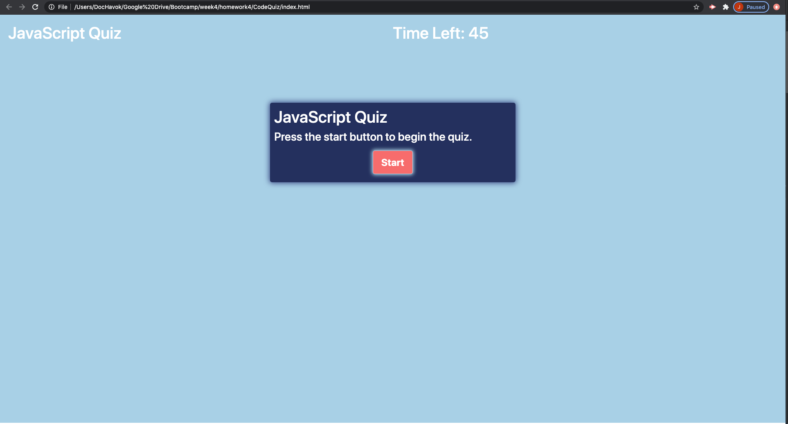

# CodeQuiz
This is a JavaScript Quiz. It's 10 question about JavaScript and you have 45 second to complete the quiz. Each question is work 10 points and you final score will be saved to local storage. Score will be called back on after your first completion. I used DOM manipulation in Javascript to generate each section of the quiz. 
Your site is published at https://jrgsepulveda.github.io/CodeQuiz/

